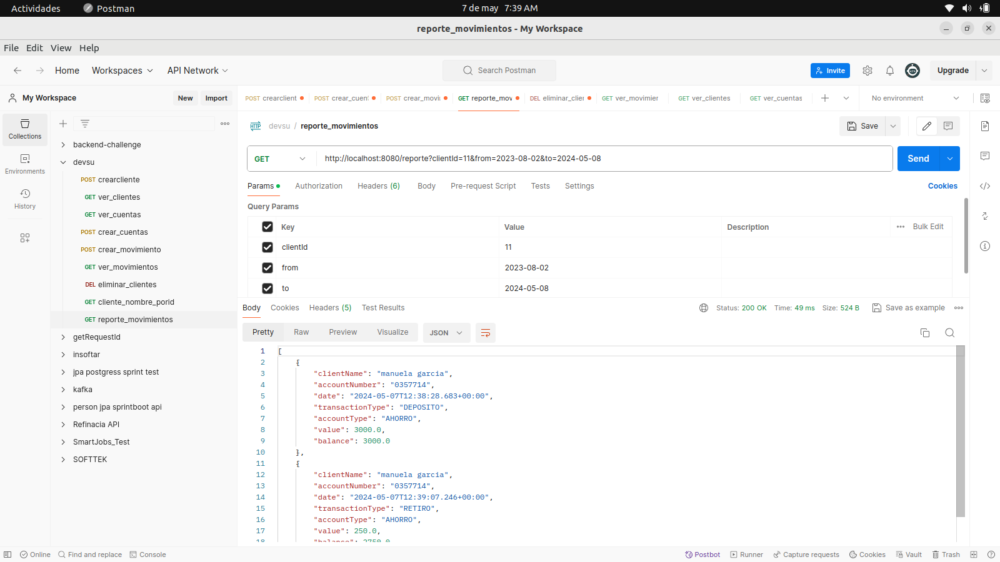

Microservicio de cuentas

Tecnologias:

* SpringBoot
* docker
* docker-compose
* Mysql
* com.h2database
* Junit
* Mockito
* rabbitmq

Compilar el proyecto

**mvn clean install**

construye la imagen con la compilacion del proyecto sin cache

**docker-compose build --no-cache**

sube nuestras imagenes a docker

**docker-compose up**

evidencia de funcionamiento:

